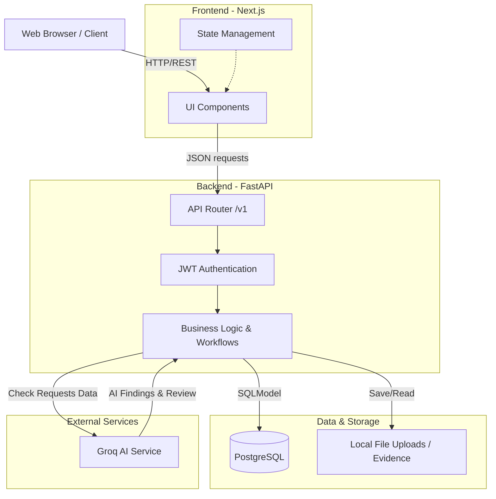

# BuildPay AI

> **AI-powered construction project controls for evidence, measurements, variations, payment certificates, approvals, and auditable workflows.**

## Overview

BuildPay AI solves the complex challenge of construction project payments and controls. It connects the fragmented lifecycle of Bill of Quantities (BOQ), check requests, measurements, variations, and Interim Payment Certificates (IPCs) into a single, cohesive, auditable platform.

## Core Principle

> **AI prepares, checks, calculates, and flags. Humans authorize.**

BuildPay AI is not an autonomous financial authority. AI assists the workflow by analyzing evidence, checking tolerances, and recommending actions, but every financial and project decision requires explicit human authorization with a complete audit trail.

## Key Capabilities

- **Projects & BOQ**: Track projects and their Bill of Quantities.
- **Check Requests**: Submit work for review with evidence.
- **Measurements**: Record actual work completed against BOQ items.
- **Variations**: Manage deviations from original scope.
- **IPCs**: Automatically generate Interim Payment Certificates based on verified measurements.
- **Approvals & Audit**: Multi-role approvals with immutable audit trails.
- **AI Reviews**: AI analyzes check requests and flags potential issues.

## Architecture

## Documentation

📚 [Documentation Hub](docs/README.md)

- [Product Overview](docs/product/product-overview.md)
- [Architecture](docs/architecture/overview.md)
- [API Reference](docs/api/overview.md)
- [Development Guide](docs/development/local-setup.md)
- [Security](docs/security/security-model.md)
- [Deployment](docs/deployment/overview.md)
- [Architecture Decisions](docs/decisions/README.md)
- [AI Prompt Library](docs/prompts/README.md)
